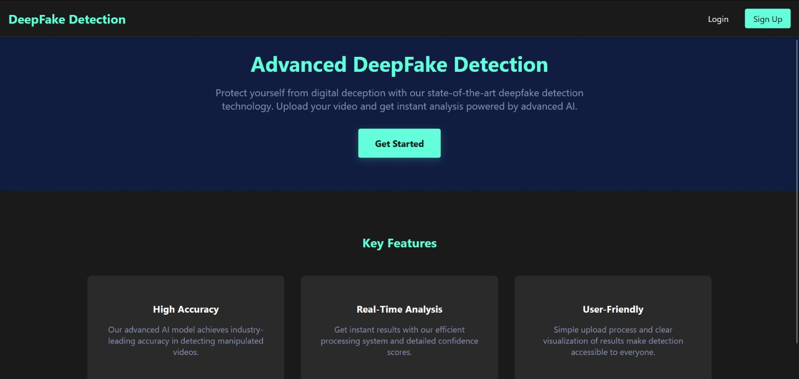

## True Vision - DeepFake Detection using ML

A DeepFake Detection Web Application using Deep Learning (ResNext and LSTM), Flask, and React that predicts whether a video is FAKE or REAL along with a confidence ratio.

## System Requirements

Flexible Project but below prerequisites are recommended: 
- Python 3.10.x (Required for compatibility with provided wheel files)
- pip (Python package installer)
- Windows OS (for provided wheel files)
- Visual C++ Build Tools (for Windows)

## Project Overview

This project implements a DeepFake Detection system using:
- Deep Learning techniques (ResNext and LSTM)
- Flask Backend
- React Frontend
- Face Recognition for processing

## Download Our Model 

- Download [df_model.pt](https://drive.google.com/drive/folders/1-zErGZ9T89TplQs3ws4QVRFlqE-ljW6l) and place it in the model folder.

## Model Information

- Dataset: [Celeb-DF](https://github.com/yuezunli/celeb-deepfakeforensics)
- Model Download: [Google Drive](https://drive.google.com/drive/folders/1-zErGZ9T89TplQs3ws4QVRFlqE-ljW6l)
- Training Reference: [DeepFake Detection Repository](https://github.com/abhijitjadhav1998/Deepfake_detection_using_deep_learning/tree/master/Model%20Creation)

## Performance Metrics

- Model Accuracy: 96.97%
- Detailed metrics and graphs available in the repository.

## Acknowledgments

- Celeb-DF dataset
- DeepFake++ detection implementation

## Project Homepage

 
